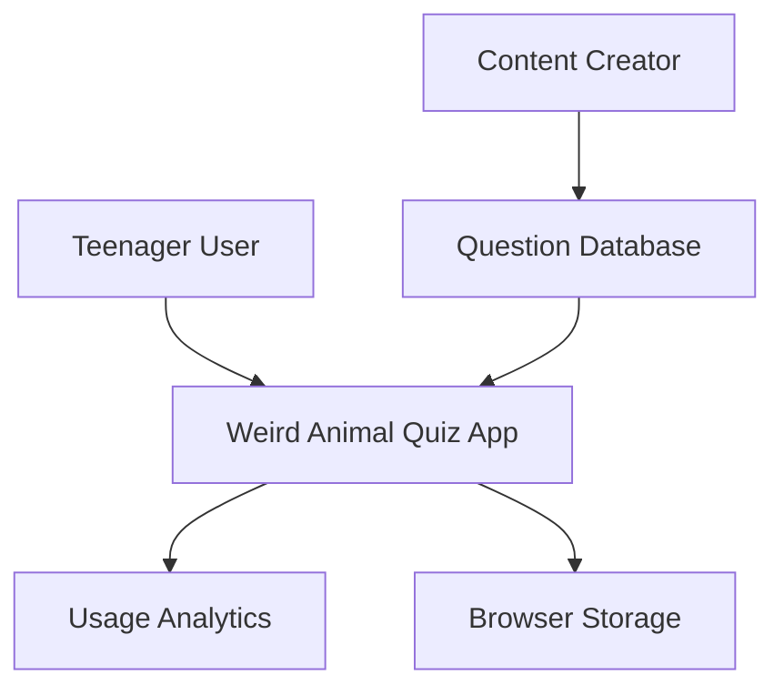
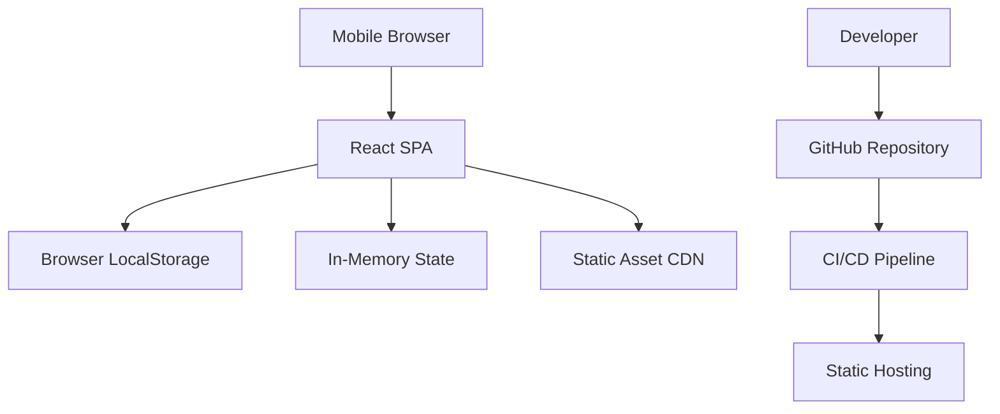
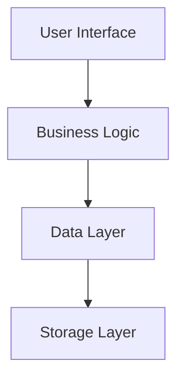
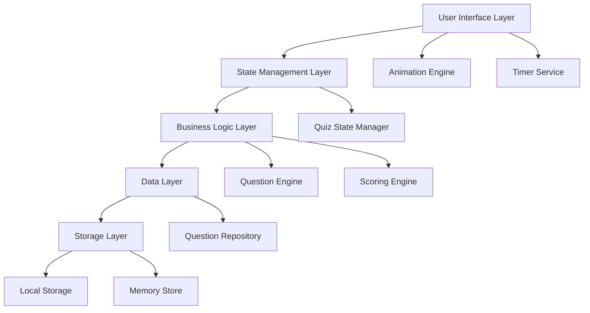
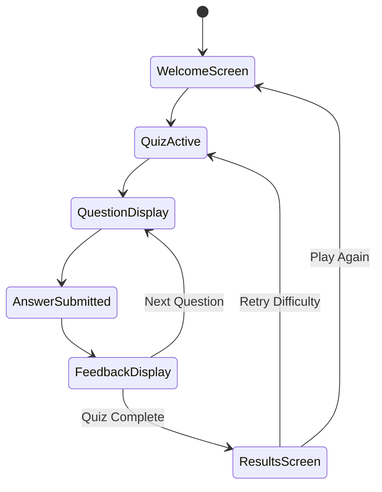
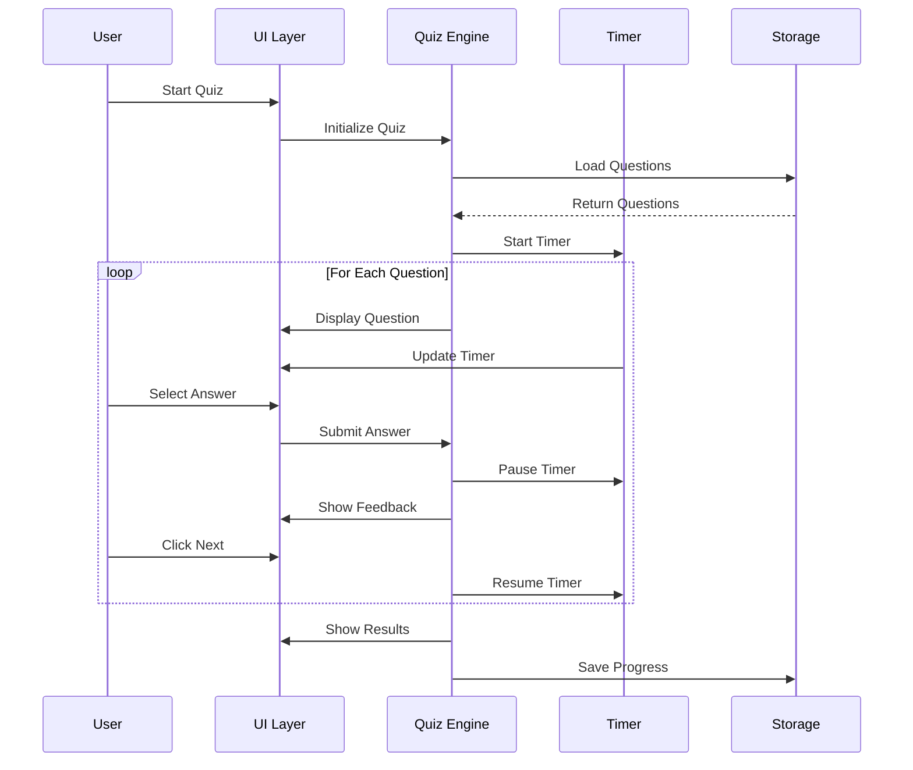
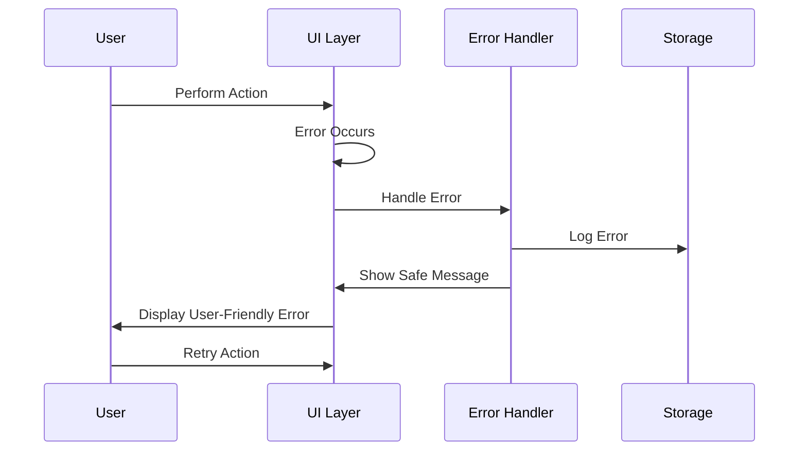
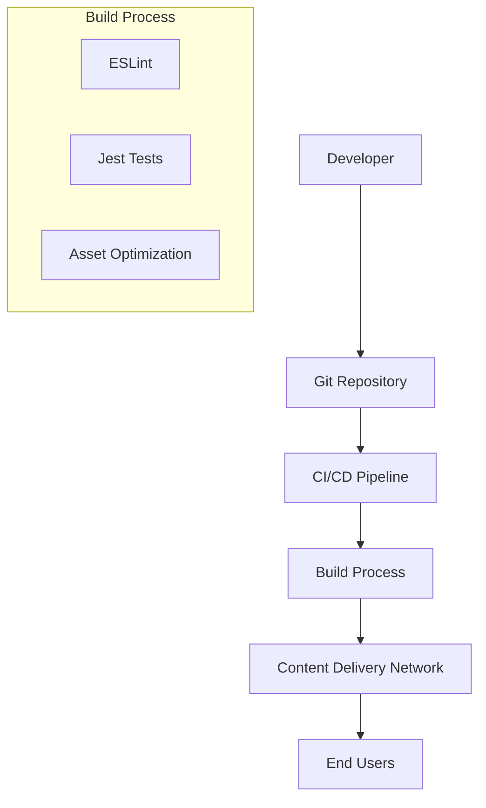
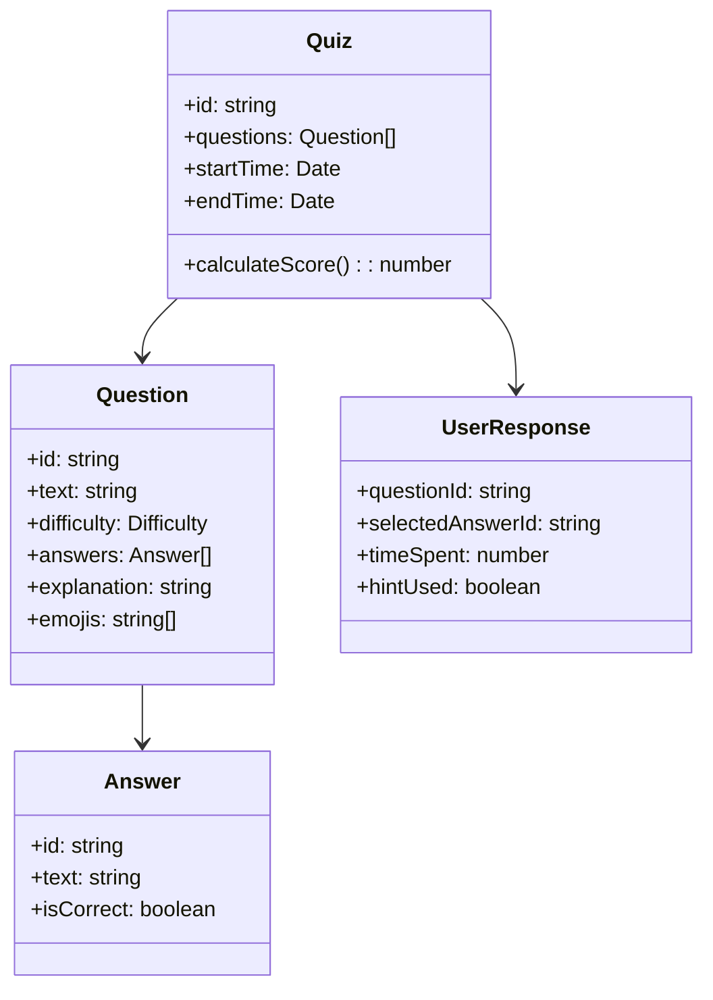

# Design Document

## 1. Introduction and Goals

### 1.1 Requirements Overview
The Weird Animal Quiz is a React-based single-page application (SPA) designed with a mobile-first approach. The application delivers a smooth, engaging quiz experience about fascinating animal facts, emphasizing performance, security, and accessibility while maintaining a nature-inspired aesthetic that appeals to curious teenagers.

### 1.2 Quality Goals
| Priority | Quality Goal | Scenario |
|----------|-------------|----------|
| 1 | **Usability** | Teenagers can complete the quiz intuitively on mobile devices without instructions |
| 2 | **Performance** | App loads and becomes interactive within 2 seconds on 3G connections |
| 3 | **Security** | All dependencies verified, input sanitized, no data exposure |
| 4 | **Accessibility** | WCAG 2.1 AA compliance for users with disabilities |
| 5 | **Maintainability** | New questions can be added without code changes |

### 1.3 Stakeholders
| Role | Contact | Expectations |
|------|---------|-------------|
| **End Users** | Teenagers 13-17 | Engaging, fast, mobile-friendly quiz experience |
| **Content Creators** | Education Team | Easy content management and updates |
| **Developers** | Development Team | Clean, maintainable, secure codebase |
| **Security Team** | InfoSec | Secure application with no vulnerabilities |

## 2. Architecture Constraints

### 2.1 Technical Constraints
- **Platform**: Web application (mobile-first)
- **Browser Support**: Modern browsers (Chrome 90+, Safari 14+, Firefox 88+)
- **Framework**: React 18 with TypeScript
- **Bundle Size**: Maximum 200KB initial load
- **Performance**: 60fps animations, <100ms response times

### 2.2 Organizational Constraints
- **Development Time**: 4-6 weeks for MVP
- **Team Size**: 2-3 developers
- **Budget**: Open source dependencies only
- **Compliance**: WCAG 2.1 AA accessibility standards

### 2.3 Conventions
- **Code Style**: ESLint + Prettier configuration
- **Naming**: camelCase for variables, PascalCase for components
- **Testing**: Minimum 80% code coverage
- **Documentation**: JSDoc for all public interfaces

## 3. System Scope and Context

### 3.1 Business Context


### 3.2 Technical Context


## 4. Solution Strategy

### 4.1 Technology Decisions
| Decision | Rationale |
|----------|-----------|
| **React + TypeScript** | Type safety, component reusability, large ecosystem |
| **CSS Modules** | Scoped styles, no naming conflicts, mobile-first approach |
| **Framer Motion** | Smooth animations, gesture support, performance optimized |
| **Context API** | Built-in state management, no external dependencies |

### 4.2 Top-Level Decomposition
- **Presentation Layer**: React components with responsive design
- **Business Logic Layer**: Quiz engine, scoring, timer management
- **Data Layer**: Question repository, user progress tracking
- **Infrastructure Layer**: Build tools, testing, deployment

### 4.3 Achieving Quality Goals
| Quality Goal | Approach |
|--------------|----------|
| **Usability** | Mobile-first design, intuitive navigation, clear feedback |
| **Performance** | Code splitting, lazy loading, optimized assets |
| **Security** | Input validation, dependency scanning, CSP headers |
| **Accessibility** | Semantic HTML, ARIA labels, keyboard navigation |

## 5. Building Block View

### 5.1 Level 1: System Overview



### 5.2 Level 2: Application Architecture



### Technology Stack

- **Frontend Framework**: React 18 with TypeScript
- **Styling**: CSS Modules with PostCSS for mobile-first responsive design
- **State Management**: React Context API with useReducer for complex state
- **Animation**: Framer Motion for smooth transitions and micro-interactions
- **Testing**: Jest and React Testing Library for unit and integration tests
- **Accessibility**: React ARIA components and semantic HTML

### Application Flow



## Components and Interfaces

### Core Components

#### 1. App Component
- **Purpose**: Root component managing global state and routing
- **Props**: None
- **State**: Global quiz state, theme preferences, accessibility settings
- **Responsibilities**: 
  - Initialize application
  - Manage global error boundaries
  - Provide context providers

#### 2. WelcomeScreen Component
- **Purpose**: Landing page with quiz introduction and start button
- **Props**: `onStartQuiz: () => void`
- **State**: Loading state for quiz initialization
- **Features**:
  - Nature-inspired hero section with animal imagery
  - Quiz overview (9 questions, 3 difficulty levels)
  - Accessibility options toggle

#### 3. QuizContainer Component
- **Purpose**: Main quiz orchestrator managing question flow
- **Props**: `questions: Question[]`, `onComplete: (results: QuizResults) => void`
- **State**: Current question index, user answers, timer state, hint usage
- **Responsibilities**:
  - Question progression logic
  - Timer management
  - Progress tracking

#### 4. QuestionCard Component
- **Purpose**: Individual question display with answers and interactions
- **Props**: 
  ```typescript
  interface QuestionCardProps {
    question: Question;
    onAnswer: (answerId: string) => void;
    onHintUsed: () => void;
    timeRemaining: number;
    hintAvailable: boolean;
    difficulty: 'easy' | 'medium' | 'hard';
  }
  ```
- **Features**:
  - Animated question transitions
  - Touch-optimized answer buttons
  - Visual difficulty indicators
  - Hint system integration

#### 5. TimerComponent
- **Purpose**: Visual countdown timer with warnings
- **Props**: `duration: number`, `onTimeUp: () => void`, `paused: boolean`
- **State**: Current time, warning states
- **Features**:
  - Circular progress indicator
  - Color-coded warnings (green → yellow → red)
  - Smooth animations

#### 6. FeedbackDisplay Component
- **Purpose**: Show answer results with explanations
- **Props**: 
  ```typescript
  interface FeedbackProps {
    isCorrect: boolean;
    correctAnswer: string;
    explanation: string;
    onNext: () => void;
  }
  ```
- **Features**:
  - Animated feedback (checkmark/X icons)
  - Rich text explanations with animal facts
  - Delayed "Next" button activation

#### 7. ResultsScreen Component
- **Purpose**: Final score display with retry options
- **Props**: `results: QuizResults`, `onRestart: () => void`, `onRetryDifficulty: (difficulty: string) => void`
- **Features**:
  - Score breakdown by difficulty
  - Performance visualization (charts/graphs)
  - Social sharing capabilities

### Data Interfaces

#### Question Interface
```typescript
interface Question {
  id: string;
  difficulty: 'easy' | 'medium' | 'hard';
  text: string;
  emojis: string[];
  answers: Answer[];
  explanation: string;
  funFact: string;
  category: string;
}

interface Answer {
  id: string;
  text: string;
  isCorrect: boolean;
}
```

#### Quiz State Interface
```typescript
interface QuizState {
  currentQuestionIndex: number;
  questions: Question[];
  userAnswers: UserAnswer[];
  timeRemaining: number;
  hintsUsed: string[];
  quizStartTime: Date;
  quizEndTime?: Date;
  isComplete: boolean;
}

interface UserAnswer {
  questionId: string;
  selectedAnswerId: string;
  isCorrect: boolean;
  timeSpent: number;
  hintUsed: boolean;
}
```

## Data Models

### Question Repository
The application uses a static question repository with 9 carefully curated questions:

```typescript
const QUIZ_QUESTIONS: Question[] = [
  // Easy Questions (3)
  {
    id: 'easy-1',
    difficulty: 'easy',
    text: 'Which animal can sleep for up to 22 hours a day?',
    emojis: ['🐨', '😴'],
    answers: [
      { id: 'a1', text: 'Koala', isCorrect: true },
      { id: 'a2', text: 'Sloth', isCorrect: false },
      { id: 'a3', text: 'Panda', isCorrect: false },
      { id: 'a4', text: 'Cat', isCorrect: false }
    ],
    explanation: 'Koalas sleep 18-22 hours daily to conserve energy for digesting eucalyptus leaves.',
    funFact: 'Koalas have fingerprints almost identical to humans!',
    category: 'behavior'
  },
  // Medium and Hard questions follow similar structure...
];
```

### Scoring System
```typescript
interface ScoringEngine {
  calculateScore(answers: UserAnswer[]): QuizResults;
  getPerformanceByDifficulty(answers: UserAnswer[]): DifficultyBreakdown;
  generateFeedback(score: number): string;
}

interface QuizResults {
  totalScore: number;
  percentage: number;
  correctAnswers: number;
  totalQuestions: number;
  timeSpent: number;
  difficultyBreakdown: DifficultyBreakdown;
  hintsUsed: number;
}
```

## Error Handling

### Error Boundary Strategy
- **Global Error Boundary**: Catches unhandled React errors
- **Component-Level Boundaries**: Isolate failures in quiz components
- **Graceful Degradation**: Fallback UI for broken components

### Error Types and Handling
```typescript
enum ErrorType {
  TIMER_ERROR = 'TIMER_ERROR',
  STATE_ERROR = 'STATE_ERROR',
  STORAGE_ERROR = 'STORAGE_ERROR',
  ANIMATION_ERROR = 'ANIMATION_ERROR'
}

interface ErrorHandler {
  handleError(error: Error, errorType: ErrorType): void;
  logError(error: Error, context: string): void;
  showUserFriendlyMessage(errorType: ErrorType): void;
}
```

### Recovery Mechanisms
- **Auto-save**: Quiz progress saved every 10 seconds
- **State Recovery**: Restore quiz state from localStorage on app restart
- **Retry Logic**: Automatic retry for transient errors
- **Manual Recovery**: "Something went wrong" screen with restart option

## Testing Strategy

### Unit Testing
- **Components**: Test rendering, props handling, user interactions
- **Hooks**: Test custom hooks for timer, quiz state management
- **Utilities**: Test scoring engine, question shuffling, validation

### Integration Testing
- **Quiz Flow**: Complete quiz journey from start to finish
- **State Management**: Test state transitions and persistence
- **Timer Integration**: Test timer behavior with question flow

### Accessibility Testing
- **Screen Reader**: Test with NVDA/JAWS screen readers
- **Keyboard Navigation**: Ensure full keyboard accessibility
- **Color Contrast**: Automated testing with axe-core
- **Focus Management**: Test focus trapping and restoration

### Performance Testing
- **Load Time**: Measure initial load and time-to-interactive
- **Animation Performance**: Monitor frame rates during transitions
- **Memory Usage**: Test for memory leaks during extended use
- **Mobile Performance**: Test on various mobile devices and network conditions

### Security Testing
- **Input Validation**: Test XSS prevention and input sanitization
- **Dependency Scanning**: Regular security audits of npm packages
- **Content Security Policy**: Test CSP implementation
- **Local Storage**: Verify secure data handling practices

## Mobile-First Design Considerations

### Responsive Breakpoints
- **Mobile**: 320px - 767px (primary target)
- **Tablet**: 768px - 1023px
- **Desktop**: 1024px+ (enhancement)

### Touch Interactions
- **Minimum Touch Targets**: 44px × 44px with 8px spacing
- **Gesture Support**: Swipe gestures for question navigation (optional)
- **Haptic Feedback**: Subtle vibration for correct/incorrect answers
- **Touch States**: Clear visual feedback for touch interactions

### Performance Optimizations
- **Code Splitting**: Lazy load non-critical components
- **Image Optimization**: WebP format with fallbacks
- **Caching Strategy**: Service worker for offline functionality
- **Bundle Size**: Target <200KB initial bundle size

### Accessibility Features
- **High Contrast Mode**: Alternative color scheme
- **Large Text Support**: Scalable typography up to 200%
- **Reduced Motion**: Respect prefers-reduced-motion
- **Voice Control**: ARIA labels for voice navigation

## Security

### Dependency Security

#### Package Verification Strategy
```typescript
interface PackageVerification {
  verifyPackageName(packageName: string): boolean;
  checkDownloadCount(packageName: string): Promise<number>;
  validateMaintainer(packageName: string): Promise<boolean>;
  scanForTyposquatting(packageName: string): boolean;
}
```

#### Approved Package Criteria
- **Download Threshold**: Minimum 1M weekly downloads
- **Maintainer Verification**: Active GitHub profiles with verified organizations
- **Repository Checks**: Official repositories with recent commits and issue management
- **Security Audits**: Regular npm audit and Snyk scanning
- **Typosquatting Prevention**: Exact name matching against official documentation

#### Core Dependencies Security Profile
```typescript
const APPROVED_PACKAGES = {
  'react': { minDownloads: 20000000, maintainer: 'facebook', verified: true },
  'react-dom': { minDownloads: 20000000, maintainer: 'facebook', verified: true },
  'typescript': { minDownloads: 45000000, maintainer: 'microsoft', verified: true },
  'framer-motion': { minDownloads: 2000000, maintainer: 'framer', verified: true },
  // Additional approved packages...
};
```

### Input Validation and Sanitization

#### Client-Side Validation
```typescript
interface InputValidator {
  sanitizeUserInput(input: string): string;
  validateQuestionId(id: string): boolean;
  validateAnswerId(id: string): boolean;
  preventXSSAttacks(input: string): string;
}

class SecurityValidator implements InputValidator {
  sanitizeUserInput(input: string): string {
    // Remove HTML tags, script tags, and dangerous characters
    return input
      .replace(/<script\b[^<]*(?:(?!<\/script>)<[^<]*)*<\/script>/gi, '')
      .replace(/<[^>]*>/g, '')
      .replace(/javascript:/gi, '')
      .replace(/on\w+=/gi, '');
  }
  
  validateQuestionId(id: string): boolean {
    // Only allow alphanumeric characters and hyphens
    return /^[a-zA-Z0-9-]+$/.test(id) && id.length <= 50;
  }
}
```

#### Server-Side Validation (if backend is added)
```typescript
interface ServerValidator {
  validateRequest(request: any): ValidationResult;
  sanitizeData(data: any): any;
  preventSQLInjection(query: string): string;
}
```

### Data Security and Storage

#### Secure Storage Strategy
```typescript
interface SecureStorage {
  // Non-sensitive data in localStorage
  saveQuizProgress(progress: QuizProgress): void;
  saveUserPreferences(preferences: UserPreferences): void;
  
  // Sensitive data in memory only
  storeSessionData(data: SessionData): void;
  clearSensitiveData(): void;
}

// Only store non-sensitive data in localStorage
interface SafeStorageData {
  currentQuestionIndex: number;
  difficulty: string;
  startTime: string;
  // NO user identification, scores, or personal data
}
```

#### Memory Management
```typescript
class SecureMemoryManager {
  private sensitiveData: Map<string, any> = new Map();
  
  store(key: string, data: any): void {
    this.sensitiveData.set(key, data);
  }
  
  retrieve(key: string): any {
    return this.sensitiveData.get(key);
  }
  
  clearAll(): void {
    this.sensitiveData.clear();
  }
  
  // Automatic cleanup on page unload
  setupCleanup(): void {
    window.addEventListener('beforeunload', () => this.clearAll());
  }
}
```

### Network Security

#### HTTPS Enforcement
```typescript
// Enforce HTTPS in production
if (process.env.NODE_ENV === 'production' && location.protocol !== 'https:') {
  location.replace(`https:${location.href.substring(location.protocol.length)}`);
}
```

#### Content Security Policy (CSP)
```html
<meta http-equiv="Content-Security-Policy" content="
  default-src 'self';
  script-src 'self' 'unsafe-inline';
  style-src 'self' 'unsafe-inline';
  img-src 'self' data: https:;
  font-src 'self';
  connect-src 'self';
  frame-ancestors 'none';
  base-uri 'self';
  form-action 'self';
">
```

#### CORS Configuration
```typescript
const corsOptions = {
  origin: process.env.ALLOWED_ORIGINS?.split(',') || ['http://localhost:3000'],
  methods: ['GET', 'POST'],
  allowedHeaders: ['Content-Type', 'Authorization'],
  credentials: false, // No credentials needed for quiz app
  maxAge: 86400 // 24 hours
};
```

### Rate Limiting and Abuse Prevention

#### Client-Side Rate Limiting
```typescript
class RateLimiter {
  private requests: Map<string, number[]> = new Map();
  private readonly maxRequests = 10;
  private readonly timeWindow = 60000; // 1 minute
  
  isAllowed(identifier: string): boolean {
    const now = Date.now();
    const userRequests = this.requests.get(identifier) || [];
    
    // Remove old requests outside time window
    const validRequests = userRequests.filter(time => now - time < this.timeWindow);
    
    if (validRequests.length >= this.maxRequests) {
      return false;
    }
    
    validRequests.push(now);
    this.requests.set(identifier, validRequests);
    return true;
  }
}
```

#### API Rate Limiting (if backend is added)
```typescript
interface APIRateLimit {
  maxRequestsPerMinute: 10;
  maxRequestsPerHour: 100;
  blockDuration: 300000; // 5 minutes
  identifier: 'ip' | 'session';
}
```

### Error Handling Security

#### Secure Error Messages
```typescript
class SecureErrorHandler {
  handleError(error: Error, context: string): void {
    // Log detailed error internally
    console.error(`[${context}] ${error.message}`, error.stack);
    
    // Show generic message to user
    this.showUserMessage(this.getSafeErrorMessage(error));
  }
  
  private getSafeErrorMessage(error: Error): string {
    // Never expose internal system details
    const safeMessages = {
      'NetworkError': 'Connection issue. Please try again.',
      'ValidationError': 'Invalid input. Please check your answer.',
      'TimeoutError': 'Request timed out. Please try again.',
      'default': 'Something went wrong. Please refresh and try again.'
    };
    
    return safeMessages[error.name] || safeMessages.default;
  }
}
```

### Code Injection Prevention

#### Template Security
```typescript
// Use React's built-in XSS protection
const SafeQuestionDisplay: React.FC<{question: Question}> = ({question}) => {
  return (
    <div>
      {/* React automatically escapes these values */}
      <h2>{question.text}</h2>
      <p>{question.explanation}</p>
      
      {/* For HTML content, use dangerouslySetInnerHTML only with sanitized content */}
      <div dangerouslySetInnerHTML={{
        __html: DOMPurify.sanitize(question.richContent)
      }} />
    </div>
  );
};
```

#### Dynamic Code Prevention
```typescript
// Prevent eval() and Function() usage
const securityPolicy = {
  'unsafe-eval': false,
  'unsafe-inline': false, // Except for necessary styles
  dynamicImports: 'static-only'
};

// ESLint rules to prevent dangerous patterns
const eslintSecurityRules = {
  'no-eval': 'error',
  'no-implied-eval': 'error',
  'no-new-func': 'error',
  'no-script-url': 'error'
};
```

### Authentication and Session Management (Future Enhancement)

#### Secure Session Handling
```typescript
interface SecureSession {
  sessionId: string;
  createdAt: Date;
  expiresAt: Date;
  isValid(): boolean;
  refresh(): void;
  destroy(): void;
}

class SessionManager {
  private readonly sessionTimeout = 30 * 60 * 1000; // 30 minutes
  
  createSession(): SecureSession {
    return {
      sessionId: this.generateSecureId(),
      createdAt: new Date(),
      expiresAt: new Date(Date.now() + this.sessionTimeout),
      isValid: function() { return new Date() < this.expiresAt; },
      refresh: function() { this.expiresAt = new Date(Date.now() + 30 * 60 * 1000); },
      destroy: function() { this.expiresAt = new Date(0); }
    };
  }
  
  private generateSecureId(): string {
    return crypto.getRandomValues(new Uint8Array(32))
      .reduce((str, byte) => str + byte.toString(16).padStart(2, '0'), '');
  }
}
```

### Security Monitoring and Auditing

#### Security Event Logging
```typescript
interface SecurityEvent {
  type: 'INVALID_INPUT' | 'RATE_LIMIT_EXCEEDED' | 'SUSPICIOUS_ACTIVITY';
  timestamp: Date;
  details: string;
  userAgent?: string;
  ipAddress?: string;
}

class SecurityMonitor {
  private events: SecurityEvent[] = [];
  
  logSecurityEvent(event: SecurityEvent): void {
    this.events.push(event);
    
    // Alert on suspicious patterns
    if (this.detectSuspiciousActivity(event)) {
      this.alertSecurityTeam(event);
    }
  }
  
  private detectSuspiciousActivity(event: SecurityEvent): boolean {
    // Detect patterns like repeated invalid inputs, rate limit violations
    const recentEvents = this.events.filter(e => 
      Date.now() - e.timestamp.getTime() < 60000 // Last minute
    );
    
    return recentEvents.length > 10;
  }
}
```

### Regular Security Maintenance

#### Automated Security Checks
```json
{
  "scripts": {
    "security:audit": "npm audit --audit-level moderate",
    "security:check": "snyk test",
    "security:monitor": "snyk monitor",
    "security:update": "npm update && npm audit fix"
  },
  "husky": {
    "hooks": {
      "pre-commit": "npm run security:audit"
    }
  }
}
```

#### Dependency Update Strategy
- **Weekly**: Automated dependency updates for patch versions
- **Monthly**: Review and update minor versions
- **Quarterly**: Major version updates with thorough testing
- **Immediate**: Security patches applied within 24 hours

## 6. Runtime View

### 6.1 Quiz Flow Scenario


### 6.2 Error Handling Scenario


## 7. Deployment View

### 7.1 Infrastructure Overview


### 7.2 Deployment Strategy
| Environment | Purpose | URL Pattern | Deployment Trigger |
|-------------|---------|-------------|-------------------|
| **Development** | Local development | localhost:3000 | Manual |
| **Staging** | Testing & QA | staging.quiz-app.com | Push to develop |
| **Production** | Live application | quiz-app.com | Push to main |

### 7.3 Infrastructure Requirements
- **Static Hosting**: Netlify/Vercel for SPA hosting
- **CDN**: Global content delivery for assets
- **SSL Certificate**: HTTPS enforcement
- **Domain**: Custom domain with DNS configuration

## 8. Cross-cutting Concepts

### 8.1 Domain Model


### 8.2 User Experience Patterns
- **Progressive Disclosure**: Show information gradually to avoid overwhelming users
- **Immediate Feedback**: Instant visual response to user actions
- **Forgiving Interface**: Allow users to recover from mistakes easily
- **Consistent Navigation**: Predictable interaction patterns throughout

### 8.3 Exception/Error Handling
```typescript
enum ErrorSeverity {
  LOW = 'low',      // Cosmetic issues, app continues
  MEDIUM = 'medium', // Feature degradation, core functionality works
  HIGH = 'high',     // Core functionality broken, requires user action
  CRITICAL = 'critical' // App unusable, immediate attention required
}

interface ErrorHandlingStrategy {
  severity: ErrorSeverity;
  userMessage: string;
  recoveryAction: string;
  logLevel: 'info' | 'warn' | 'error' | 'fatal';
}
```

## 9. Architecture Decisions

### 9.1 Decision Records

#### ADR-001: React vs Vue vs Angular
**Status**: Accepted  
**Decision**: Use React with TypeScript  
**Rationale**: 
- Large ecosystem and community support
- Excellent TypeScript integration
- Strong mobile development patterns
- Team expertise and familiarity

#### ADR-002: State Management Approach
**Status**: Accepted  
**Decision**: Use React Context API with useReducer  
**Rationale**:
- No external dependencies
- Sufficient for application complexity
- Built-in React patterns
- Easier testing and debugging

#### ADR-003: Styling Strategy
**Status**: Accepted  
**Decision**: CSS Modules with PostCSS  
**Rationale**:
- Scoped styles prevent conflicts
- Mobile-first responsive design support
- No runtime overhead
- Easy maintenance and debugging

### 9.2 Trade-offs
| Decision | Pros | Cons | Mitigation |
|----------|------|------|------------|
| **SPA Architecture** | Fast navigation, smooth UX | SEO challenges, initial load time | Pre-loading, meta tags |
| **Client-side Storage** | Offline capability, fast access | Storage limits, security concerns | Data minimization, encryption |
| **No Backend** | Simple deployment, low cost | Limited analytics, no user accounts | Client-side analytics, future enhancement |

## 10. Quality Requirements

### 10.1 Quality Tree
```
Quality
├── Usability
│   ├── Learnability (5 min to complete first quiz)
│   ├── Efficiency (30 sec per question average)
│   └── Satisfaction (>4.0/5.0 user rating)
├── Performance
│   ├── Response Time (<100ms UI interactions)
│   ├── Throughput (60fps animations)
│   └── Resource Usage (<50MB memory)
├── Security
│   ├── Input Validation (100% coverage)
│   ├── Dependency Security (weekly audits)
│   └── Data Protection (no sensitive data storage)
└── Maintainability
    ├── Testability (>80% code coverage)
    ├── Modifiability (new questions without code changes)
    └── Analyzability (clear component structure)
```

### 10.2 Quality Scenarios
| Quality | Scenario | Response |
|---------|----------|----------|
| **Performance** | User opens app on 3G connection | App becomes interactive within 2 seconds |
| **Usability** | New user starts quiz without instructions | Completes quiz successfully within 5 minutes |
| **Security** | Malicious input submitted | Input sanitized, no code execution, error logged |
| **Accessibility** | Screen reader user navigates app | All content accessible via keyboard and screen reader |

## 11. Risks and Technical Debts

### 11.1 Risk Assessment
| Risk | Probability | Impact | Mitigation Strategy |
|------|-------------|--------|-------------------|
| **Browser Compatibility** | Medium | High | Progressive enhancement, polyfills |
| **Performance on Low-end Devices** | High | Medium | Code splitting, lazy loading |
| **Accessibility Compliance** | Low | High | Regular testing, automated checks |
| **Security Vulnerabilities** | Medium | High | Dependency scanning, input validation |

### 11.2 Technical Debt
| Debt Item | Impact | Priority | Resolution Plan |
|-----------|--------|----------|----------------|
| **No Backend Analytics** | Medium | Low | Implement client-side analytics first |
| **Limited Question Management** | Low | Medium | Build admin interface in phase 2 |
| **No User Accounts** | Low | Low | Add authentication in future version |

## 12. Glossary

| Term | Definition |
|------|------------|
| **SPA** | Single Page Application - web app that loads a single HTML page and dynamically updates content |
| **CSP** | Content Security Policy - security standard to prevent XSS attacks |
| **WCAG** | Web Content Accessibility Guidelines - standards for web accessibility |
| **PWA** | Progressive Web App - web app with native app-like features |
| **CDN** | Content Delivery Network - distributed server network for fast content delivery |
| **XSS** | Cross-Site Scripting - security vulnerability allowing malicious script injection |
| **CORS** | Cross-Origin Resource Sharing - mechanism for secure cross-domain requests |